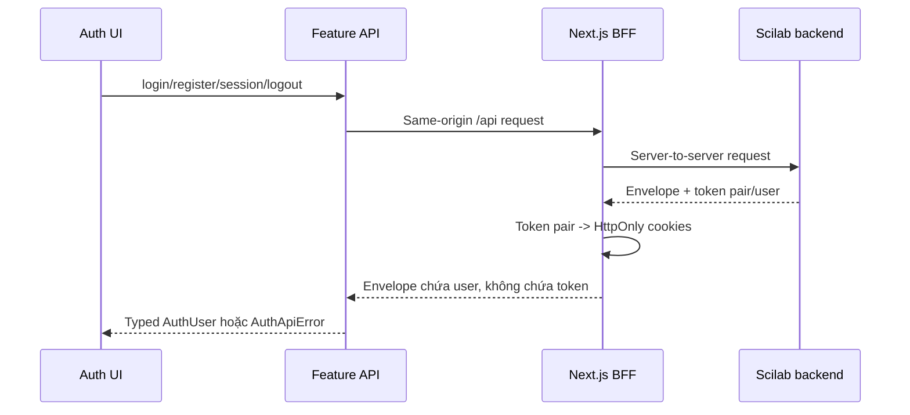
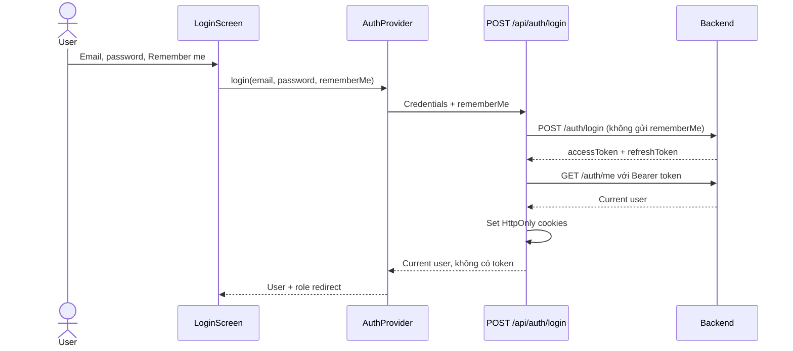
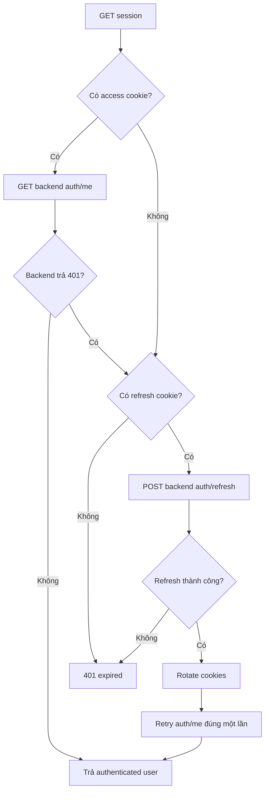

# Kiến trúc Feature-based và luồng Authentication

Tài liệu này mô tả cấu trúc frontend trong `apps/web` và luồng auth BFF đang
được sử dụng. Nội dung phản ánh code hiện tại.

## 1. Cấu trúc feature-based

```text
apps/web/src/
|-- app/                  # Next.js routes, layouts và BFF Route Handlers
|   `-- api/              # Same-origin HTTP surface cho browser
|-- core/                 # Hạ tầng nền, không thuộc một nghiệp vụ cụ thể
|   `-- api/              # HTTP transport, envelope, error và pagination chung
|-- features/
|   `-- auth/
|       |-- api/          # Typed browser API và error mapping
|       |-- components/   # Login, register, profile và route guard
|       |-- server/       # Upstream fetch, cookie và refresh logic
|       |-- testing/      # Test factories
|       |-- types/        # Auth domain/request types
|       `-- views/
|-- providers/            # Auth, query và theme state toàn app
`-- shared/
    |-- api/              # Same-origin Axios client
    |-- components/       # UI/layout dùng chung
    |-- constants/        # Routes và permissions
    |-- schemas/          # Form validation
    `-- utils/
```

Hướng phụ thuộc chính:

```text
page -> feature component -> AuthProvider -> feature API -> /api BFF
                                                        -> backend

Route Handler -> auth server helpers -> backend
feature -> shared
shared -X-> feature business UI
```

Page chỉ ánh xạ URL tới feature. Component không biết backend origin, token hoặc
cookie. Code server-only nằm trong `features/auth/server` và chỉ được Route
Handler import.

### Core khác Feature

`core` chứa cơ chế kỹ thuật dùng được cho nhiều miền nghiệp vụ. Ví dụ
`core/api` biết cách gửi request, timeout, parse response envelope và chuẩn hóa
lỗi, nhưng không biết login, journal hay notification có ý nghĩa gì.

`feature` sở hữu một nghiệp vụ cụ thể và tổ chức code theo luồng của nghiệp vụ
đó. Ví dụ `features/auth` định nghĩa login, register, session, quyền và UI auth;
`features/notifications` định nghĩa danh sách và thao tác notification. Feature
có thể phụ thuộc `core` hoặc `shared`, còn `core` không phụ thuộc UI hay quy tắc
nghiệp vụ của feature.

Trong transport hiện tại, `core/api` gọi trực tiếp backend cho public API. Với
request được đánh dấu `authenticated`, nó gọi same-origin `/api`; feature phải
có Route Handler BFF tương ứng trước khi sử dụng. Auth dùng Axios client riêng ở
`shared/api/http-client.ts` và toàn bộ request auth luôn đi same-origin.

## 2. Browser, BFF và backend

Ba vai trò phải được phân biệt:

```text
Frontend production: https://swapnet.io.vn
Browser auth API:     https://swapnet.io.vn/api/auth/*
Backend upstream:     https://scilab-api.epsilon.io.vn
```



Backend CORS không phải điều kiện cho auth browser vì browser không gọi backend
trực tiếp. BFF không phải open proxy: upstream origin cố định và browser chỉ có
các Route Handler đã định nghĩa.

## 3. Cấu hình môi trường

```env
# Server-only. Không dùng NEXT_PUBLIC_ cho backend auth origin.
SCILAB_API_ORIGIN=https://scilab-api.epsilon.io.vn
```

Biến này phải được cấu hình trong Vercel Production, Preview và Development.
Không đưa password, token hoặc server secret vào biến `NEXT_PUBLIC_*`.

## 4. Cookie session

BFF quản lý ba cookie, đều có path `/api`, `HttpOnly` và `SameSite=Lax`:

| Cookie                 | Nội dung                  | Thời hạn khi Remember me bật |
| ---------------------- | ------------------------- | ---------------------------- |
| `scilab_access_token`  | Backend access token      | 30 phút                      |
| `scilab_refresh_token` | Backend refresh token     | 30 ngày                      |
| `scilab_remember`      | Marker chế độ persistence | 30 ngày                      |

Production/Preview thêm `Secure`. Nếu Remember me tắt, cookie không có
`Max-Age` và hết khi đóng browser. Register auto-login luôn dùng session cookie.

Token không xuất hiện trong response BFF, JavaScript, React Context,
`localStorage` hoặc Axios header. Hai key cũ `scholartrend_auth_session` và
`scholartrend_demo_user` được xóa khi provider mount.

## 5. Response và lỗi

Browser và BFF dùng standard envelope:

```ts
interface ApiEnvelope<T> {
  success: boolean;
  message: string;
  data: T;
}
```

`shared/api/http-client.ts` unwrap `data` khi thành công và chuyển response lỗi
thành `AuthApiError`. BFF error code có thể nằm trong `data.code`; ví dụ account
được tạo nhưng auto-login thất bại dùng `ACCOUNT_CREATED_SIGN_IN_FAILED`.

Mọi response auth có `Cache-Control: no-store`. Network timeout/upstream failure
trả envelope an toàn và request ID, không log password hoặc token.

## 6. Luồng login



Admin đi tới admin users; student/researcher đi tới student dashboard. Login lỗi
không set cookie và UI hiển thị message đã normalize.

## 7. Luồng register

`RegisterScreen` validate bằng React Hook Form và schema hiện tại. Feature API
map field frontend sang contract backend:

| Frontend      | Backend          |
| ------------- | ---------------- |
| `firstName`   | `firstname`      |
| `lastName`    | `lastname`       |
| `dateOfBirth` | `dataofbirth`    |
| `email`       | trim + lowercase |

BFF thực hiện register → login → `/auth/me`, set session-only cookies và trả
user. UI không gọi `/auth/me` lần hai. Nếu register thành công nhưng login lỗi,
BFF trả `ACCOUNT_CREATED_SIGN_IN_FAILED` để user chuyển sang login thay vì đăng
ký lại email đã tồn tại.

## 8. Restore và refresh

Khi app mount, `AuthProvider` xóa legacy Web Storage rồi gọi
`GET /api/auth/session`:



Không có client refresh token API và không retry vô hạn. Session `401` làm
provider chuyển sang `expired`; route guard điều hướng user về login.

## 9. Logout và CSRF

`POST /api/auth/logout` forward Bearer token tới backend nếu access cookie tồn
tại. BFF luôn xóa cả ba cookie, kể cả upstream timeout hoặc lỗi.

Mọi mutation BFF yêu cầu `Origin` trùng origin của request. Request cross-origin
trả `403` trước khi gọi backend. `SameSite=Lax` bổ sung bảo vệ cookie khỏi
cross-site POST.

Route guard phía client chỉ bảo vệ UX. Backend vẫn xác thực Bearer token do BFF
forward cho mọi endpoint protected.

## 10. Thêm protected API

Khi feature mới cần authentication:

1. Thêm Route Handler same-origin dưới `app/api`.
2. Dùng helper authenticated upstream trong `features/auth/server` để inject
   access token và refresh đúng một lần.
3. Chỉ expose path/method cần thiết, không nhận upstream URL từ browser.
4. Feature API gọi `/api/...`, không đọc cookie/token.
5. Thêm test success, `401` refresh, upstream failure và origin check cho
   mutation.

Public/high-volume API có thể có transport riêng; không bắt buộc qua auth BFF.

## 11. Kiểm tra và debug

```bash
pnpm --filter web format:check
pnpm --filter web lint
pnpm --filter web check-types
pnpm --filter web test
pnpm --filter web test:e2e
pnpm --filter web build
```

Khi auth lỗi:

1. Browser request phải đi tới `/api/auth/*`, không phải backend domain.
2. Kiểm tra status/message trong BFF envelope.
3. Kiểm tra Vercel có `SCILAB_API_ORIGIN` đúng environment không.
4. Kiểm tra cookie tồn tại, đúng path `/api`, `HttpOnly`, `SameSite=Lax` và
   `Secure` trên HTTPS.
5. Kiểm tra Vercel function log bằng request ID; không gửi token/password khi
   trao đổi lỗi.

## 12. File quan trọng

| Mục đích           | File                                   |
| ------------------ | -------------------------------------- |
| Auth state         | `src/providers/auth-provider.tsx`      |
| Browser auth API   | `src/features/auth/api/auth.api.ts`    |
| BFF/cookie/refresh | `src/features/auth/server/auth-bff.ts` |
| Login route        | `src/app/api/auth/login/route.ts`      |
| Session route      | `src/app/api/auth/session/route.ts`    |
| Shared HTTP client | `src/shared/api/http-client.ts`        |
| Route access       | `src/shared/constants/route-access.ts` |
